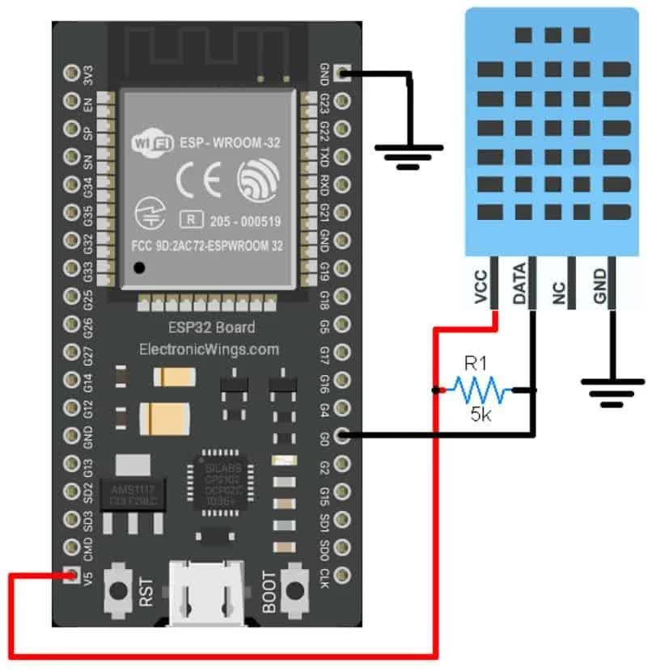
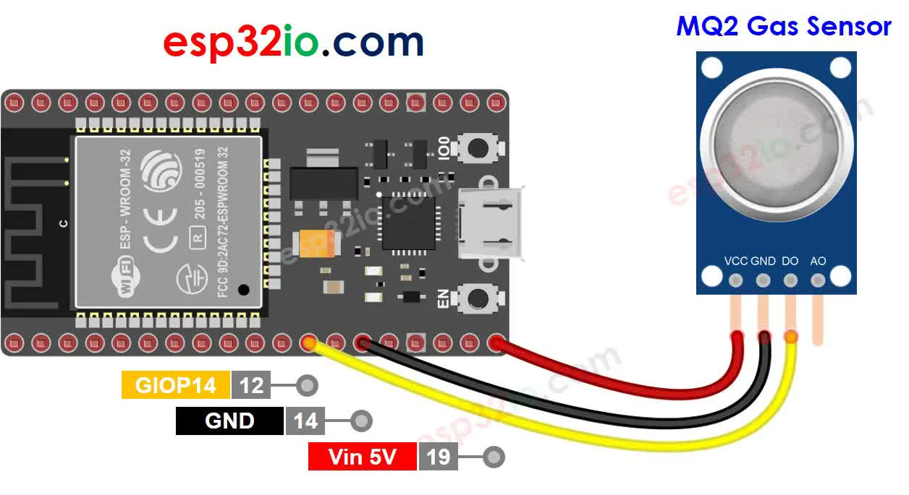

# IoT Topics

1. **Internet of Things Fundamentals and Features**
    - Network of Embedded Sensors, Devices, Software to Interact and Communicate with Data
    - Sensors collect Data from Environment
    - Communicate with Wi-Fi, Bluetooth
    - Data processed on Cloud or Locally
    - Interconnectivity over Internet
    - Data Collection and Sharing
    - Automation and Control
    - Scales from Small Networks to Large
    - Real-time Analytics
    - Cost Savings

2. **IoT Embedded Computing Board**
    - Low-power Boards like Arduino, Raspberry Pi, NodeMCU
    - Support Sensors and Actuators
    - Connect via GPIO pins
    - Programmed using IDEs and Libraries

3. **IoT Hardware**
    - Sensors, Actuators, Communication Modules
    - Power-efficient Hardware
    - Wireless Communication (Wi-Fi, BLE)
    - RFID, NFC for Identification

4. **IoT Software Stack**
    - Operating Systems (TinyOS, RIOT)
        - Device Layer (Firmware/Embedded OS): runs directly on IoT hardware, controls basic device functions such as data collection, local processing.  
          *Examples: FreeRTOS, TinyOS*
    - Communication Protocols (MQTT, CoAP)

5. **IoT Enabling Technologies**
    - Cloud Computing, Edge Computing
    - Big Data, Machine Learning
    - Blockchain for Security
    - LPWAN for Low-power Communication

6. **IoT Classification and Complexity**
    - Consumer IoT (Smart Homes)
    - Industrial IoT (Automation)
    - Complexity based on Network Scale and Processing

7. **IoT Challenges**
    - Data Security and Privacy
    - Interoperability
    - Power Consumption
    - Cost and Scalability

8. **IoT Protocols**
    - Layered Protocols (Application, Network, Transport)
    - MQTT, CoAP, HTTP
    - IPv6

9. **IoT Messaging Transport**
    - Message Queuing Telemetry Transport (MQTT)
    - Constrained Application Protocol (CoAP)
    - Data Transfer in Low-power Networks

10. **IoT Addressing**
    - Unique Identifiers (MAC, IPv6)
    - Ensures Device Distinction and Communication

11. **IoT Identification**
    - RFID Tags, QR Codes
    - Enables Device Tracking and Management

12. **IoT MQTT**
    - Lightweight Messaging Protocol
    - Publish/Subscribe Communication Model
    - Used in Low-bandwidth, High-latency Networks

13. **IoT CoAP**
    - Constrained Application Protocol for IoT
    - Client-server Protocol for Low-power Devices

14. **IoT Li-Fi**
    - Light-based Communication
    - High-speed Data Transfer using LEDs

15. **IoT BLE**
    - Bluetooth Low Energy
    - Low-power Wireless Communication for IoT

16. **IPv4 and IPv6**
    - Internet Protocol Versions
    - IPv6 Enables More Unique Addresses for IoT Devices

17. **IoT Cloud**
    - Centralized Data Storage and Processing
    - Enables Remote Device Management

18. **IoT Cloud Computing Fundamentals**
    - Infrastructure-as-a-Service (IaaS), Platform-as-a-Service (PaaS)
    - Elastic Scaling and Data Availability

19. **IoT Challenges of Cloud**
    - Latency and Bandwidth Issues
    - Data Privacy and Compliance
    - Scalability of Devices

20. **IoT Cloud Service Providers**
    - Amazon AWS, Microsoft Azure, Google Cloud
    - Offer IoT Platforms and Integration Services

21. **Fog Computing**
    - Decentralized Computing Closer to Devices
    - Reduces Latency, Increases Efficiency

22. **Security and Privacy of Cloud Computing**
    - Data Encryption, Access Control
    - Ensuring Compliance with Regulations

23. **Sensors Working**
    - Detect Physical Phenomena (e.g., Temperature, Pressure)
    - Convert to Electrical Signals for Processing

24. **Actuators Working**
    - Convert Electrical Signals to Physical Action
    - Used for Control Systems (Motors, Valves)

25. **Arduino UNO Features**
    - ATmega328 Microcontroller
    - 14 Digital I/O Pins, 6 Analog Inputs
    - 8 bit Architecture
    - 6 PWM pins
    - 5V Output Pins
    - 32 KB Flash Memory
    - 2 KB SRAM
    - USB, Power Jack for Connectivity

26. **Raspberry Pi Features**
    - Broadcom Processor
    - 40 GPIO Pins for Sensors, Actuators, etc
    - HDMI, USB, Ethernet Connectivity
    - 5V input
    - 3.5mm audio jack

27. **NodeMCU Features**
    - ESP8266 Wi-Fi Chip
    - Integrates GPIO, PWM, I2C, SPI, and ADC
    - 32 bit RISC CPU
    - 17 GPIO Pins
    - 4 MB Flash Memory

28. **IoT Basic Sensors with NodeMCU and Raspberry Pi (Diagram and Theory)**
    - Temperature + Humidity Sensor (Agriculture): DHT11
    

    - Gas + Pollution Sensor (Pollution): MQ-02
    

29. **Python Basics and Interacting with Raspberry Pi**
    - Control GPIO Pins with Python
    - Write Scripts to Monitor and Control Sensors

30. **IoT Applications with Embedded System Board**
    - Smart Homes, Health Monitoring
    - Industrial Automation, Agriculture
